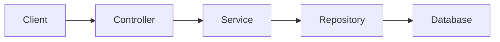

# 🔗 URL Shortener API

A simple and secure **Spring Boot URL Shortener** that converts long URLs into short codes and redirects users to the original link.

Built using **Spring Boot, Spring Security, and PostgreSQL**, this project demonstrates backend development concepts like **REST APIs, database persistence, authentication, and URL redirection**.

Think of it as a **mini Bit.ly built with Java**.

---

# ✨ Features

🔗 Convert long URLs into short URLs  
⚡ Instant redirection using short code  
👤 User registration with encrypted passwords  
🛡 Basic security using Spring Security  
🗄 Persistent storage with PostgreSQL  
📦 Clean layered architecture  

---

# 🛠 Tech Stack

| Technology | Purpose |
|-----------|--------|
| ☕ Java | Programming language |
| 🌱 Spring Boot | Backend framework |
| 🔐 Spring Security | Authentication |
| 🗃 Spring Data JPA | Database interaction |
| 🐘 PostgreSQL | Database |
| 📦 Maven | Dependency management |

---

# 🏗 System Architecture

The application follows a **layered backend architecture**.



### Controller
Handles HTTP requests such as registering users and redirecting URLs.

Example: `UrlsShortController`

### Service
Contains business logic like generating short codes and retrieving URLs.

Example: `UrlService`

### Repository
Handles database operations using Spring Data JPA.

Example: `UrlRepository`

### Database
Stores user accounts and shortened URLs.

---

# 📁 Project Structure

```
url-shortener
│
├── controller
│   └── UrlsShortController.java
│
├── service
│   └── UrlService.java
│
├── repository
│   ├── UrlRepository.java
│   └── UserRepository.java
│
├── model
│   ├── UrlInfo.java
│   └── User.java
│
├── security
│   └── SecurityConfig.java
│
└── UrlShortApplication.java
```

---

# 🔗 How URL Shortening Works

1️⃣ User submits a long URL  
2️⃣ Backend generates a **unique short code**  
3️⃣ Short code is stored in database  
4️⃣ Visiting the short code redirects to the original URL

Example:

```
Original URL
https://www.example.com/very/long/url
```

```
Short URL
http://localhost:8080/abc123
```

---

# 🌐 API Endpoints

### 👤 User API

| Method | Endpoint | Description |
|------|------|-------------|
| POST | /register | Register a new user |

---

### 🔗 URL APIs

| Method | Endpoint | Description |
|------|------|-------------|
| GET | /{shortCode} | Redirect to original URL |

Example:

```
GET /abc123
```

Redirects to:

```
https://original-url.com
```

---

# 📬 API Request Examples

## Register User

```
POST /register
Content-Type: application/json
```

```
{
  "username": "cos",
  "password": "12345"
}
```

---

## Redirect to Original URL

```
GET /abc123
```

If the short code exists, the user is redirected to the original URL.

---

# ⚙ Short Code Generation

Short codes are generated using **UUID-based random values**.

Example implementation:

```
UUID.randomUUID().toString().substring(0,6)
```

This produces short codes like:

```
a8f2c1
d9b321
x12ac9
```

---

# ⚡ Running the Project

### 1 Clone repository

```
git clone https://github.com/yourusername/url-shortener.git
```

---

### 2 Navigate to project

```
cd url-shortener
```

---

### 3 Configure database

Update `application.properties`

```
spring.datasource.url=jdbc:postgresql://localhost:5432/urlshort
spring.datasource.username=youruser
spring.datasource.password=yourpassword
```

---

### 4 Run application

```
mvn spring-boot:run
```

Server runs at

```
http://localhost:8080
```

---

# 🧪 Testing

Use **Postman or browser**.

Example test:

```
http://localhost:8080/abc123
```

If the short code exists, the browser redirects to the original URL.

---

# 🔮 Future Improvements

🚀 Custom short URLs  
📊 URL analytics (click tracking)  
🕒 Expiring links  
🔐 JWT authentication  
📜 Swagger API documentation  

---

# 📚 What I Learned

✔ Building REST APIs with Spring Boot  
✔ Implementing URL redirection logic  
✔ Working with relational databases using JPA  
✔ Secure password storage using BCrypt  
✔ Designing backend services with layered architecture  

---

⭐ If you like this project, consider giving it a **star on GitHub**.
